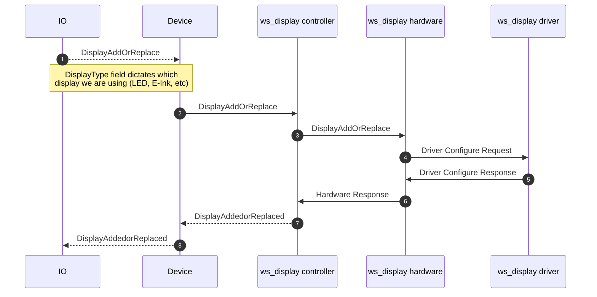
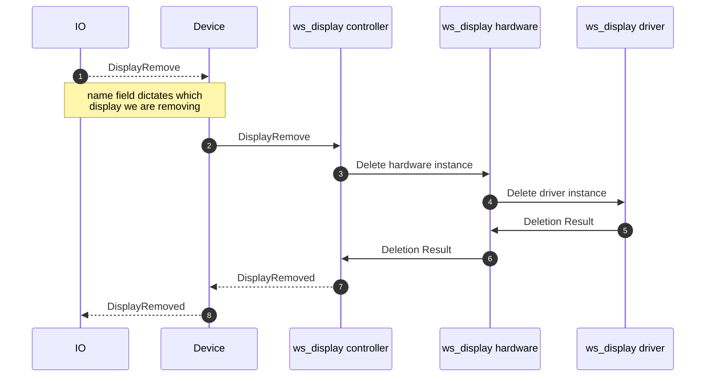
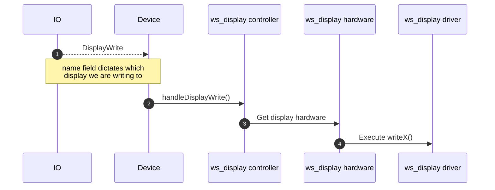

# display.proto

This file details the WipperSnapper messaging API for interfacing with a display.

## WipperSnapper Components

The following WipperSnapper Components may utilize `display.proto`:

* E-Ink/E-Paper Displays
* TFT Displays
* OLED Displays
* 7-Segment Displays
* Alphanumeric Displays
* LCD Character Displays

## Sequence Diagrams

### Attaching a Display Component to a device running WipperSnapper

### Removing a Display Component from a device running WipperSnapper

### Writing to a Display from IO

The display message is set by the component's feed value, which is a string. The message is sent to the display driver.

